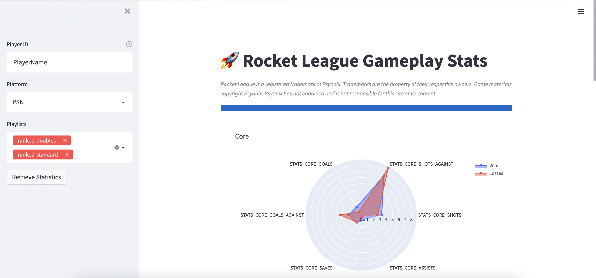

# Rocket League Statistics Web App 🚀

[](https://share.streamlit.io/tom-boyes-park/rl-stats-app/main/app.py)

Web app to allow users to retrieve their recent Rocket League game statistics and view radar charts comparing statistics
between game wins and losses.

Relies on users having their game replays uploaded to [ballchasing.com](https://ballchasing.com/)



## Running Locally

Install requirements:
```commandline
pip install -r requirements.txt
```

Set environment variable for ballchasing API token:
```commandline
export BC_API_TOKEN=<your-token>
```

Run the app:
```commandline
streamlit run app.py
```
